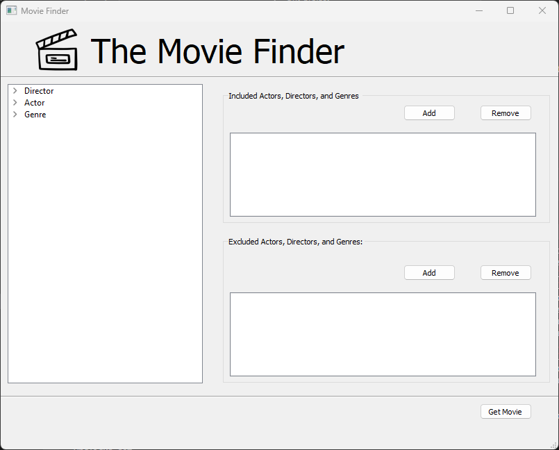
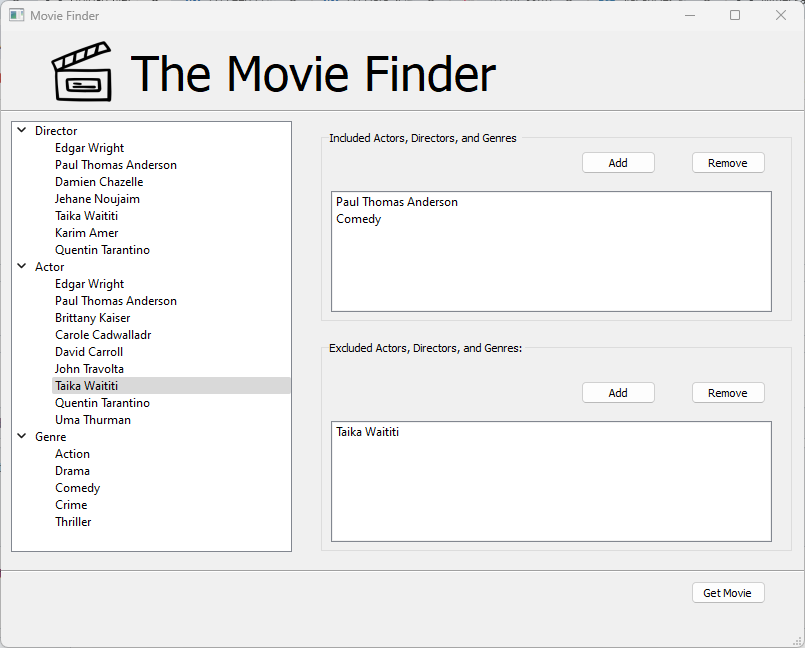
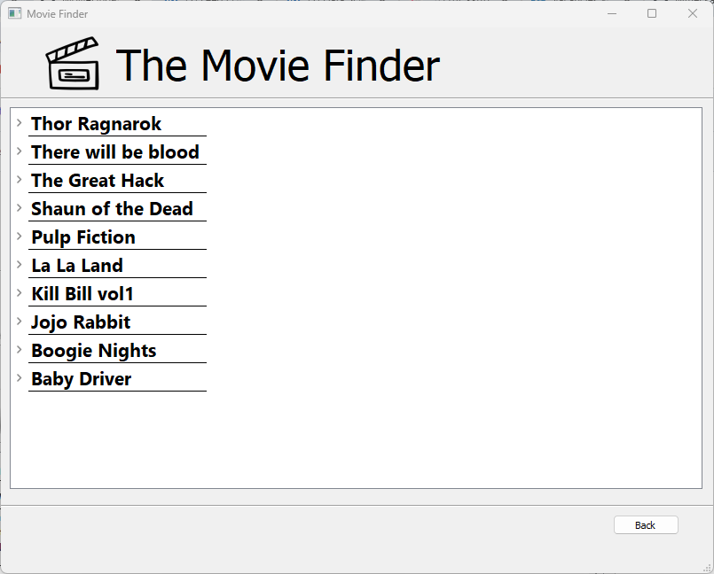
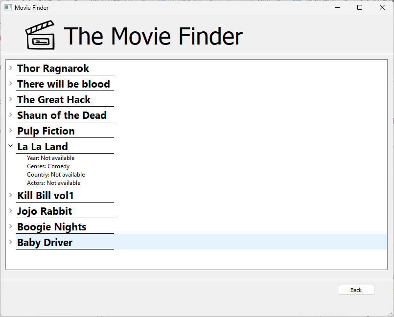
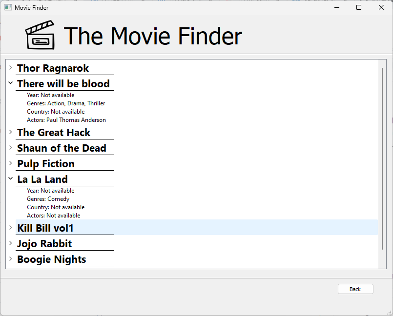

# MovieFinder_Ontology
A python application that returns you a list of films based on the included/excluded actors, directors and genres.

## Overview
This project implements a movie finder application using PyQt5 for the user interface and Owlready2 for ontology manipulation. The application allows users to manage directors, actors, and genres within a tree view by adding or removing them from included and excluded sections. After configuring their preferences, users can fetch movies that match their criteria by pressing the "Get Movie" button. Behind the scenes, Owlready2 utilizes the Pellet reasoner, an OWL DL reasoner, to infer new knowledge based on ontology axioms and rules, enabling the derivation of implicit relationships between entities. Rules written in OWL 2 RL syntax define inference patterns to deduce relationships such as genre, director, actor, and movie based on their properties and classes. Additionally, SPARQL queries are employed to retrieve specific information from the ontology, facilitating the selection of movies based on user-defined criteria. Overall, this application provides an intuitive interface for exploring and selecting movie preferences, with powerful reasoning capabilities enhancing the movie discovery experience.

## Libraries Needed
-rdflib

```bash
pip install rdflib
```

-owlready2

```bash
pip install owlready2
```
-pyqt5

```bash
pip install pyqt5
```
## How to run
Open the project folder and run pythonApplication.py
```bash
python pythonApplication.py
```
## Screenshots of Application
### Main Window




You can manage directors, actors, and genres within the tree by adding or removing them from the included and excluded sections. Once you've configured your preferences, simply press the "Get Movie" button to fetch movies that match your criteria. This action will take you to the Information Window where you can view detailed information about the selected movie.

### Information Display Window







You can expand the dropdown arrow to reveal additional movie details. To return to the main window, simply press the back button.
"# Ontology-Moviefinder-Project" 
